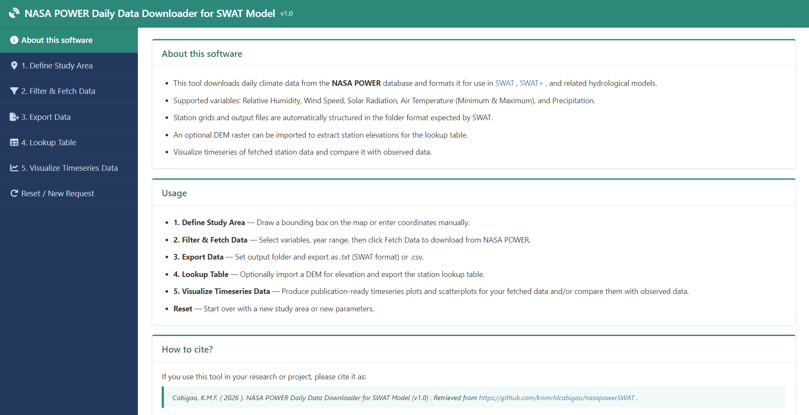

# nasapowerSWAT Tutorial

A step-by-step guide to **nasapowerSWAT** — a Shiny-based desktop app that downloads daily climate data from [NASA POWER](https://power.larc.nasa.gov/) and formats it for use in [SWAT](https://swat.tamu.edu/) and [SWAT+](https://swat.tamu.edu/software/plus/) hydrological models.

> **Cite this tool:** Cabigao, K. M. (2026). nasapowerSWAT (Version 1.0.0) [Computer software]. https://doi.org/10.5281/zenodo.20840987

---

## Table of Contents

1. [What nasapowerSWAT Does](#1-what-nasapowerswat-does)
2. [Requirements](#2-requirements)
3. [Installation](#3-installation)
4. [Launching the App](#4-launching-the-app)
5. [Tab 1 — Define Study Area](#5-tab-1--define-study-area)
6. [Tab 2 — Filter & Fetch Data](#6-tab-2--filter--fetch-data)
7. [Tab 3 — Export Data](#7-tab-3--export-data)
8. [Tab 4 — Lookup Table](#8-tab-4--lookup-table)
9. [Tab 5 — Visualize](#9-tab-5--visualize)
10. [Updating the Package](#10-updating-the-package)
11. [References & Citation](#11-references--citation)

---

## 1. What nasapowerSWAT Does

nasapowerSWAT provides a point-and-click interface to:

- **Download** daily climate data (Precipitation, Max/Min Temperature, Solar Radiation, Wind Speed, Relative Humidity) from the NASA POWER API for any location on Earth from 1981 to present
- **Format and export** data as SWAT-ready `.txt` files or general-purpose `.csv` files
- **Generate a station lookup table** with coordinates and optional DEM-based elevations — exactly what SWAT and SWAT+ need to recognise weather stations
- **Visualise** the fetched timeseries and compare it against your own observed data

No command-line interaction is needed once the app is launched.

---

## 2. Requirements

| Requirement | Minimum version |
|---|---|
| R | ≥ 4.0 |
| RStudio | Any recent version |
| Internet connection | Required (to fetch NASA POWER data) |

The following R packages are **installed automatically** as dependencies:

`shiny`, `leaflet`, `leaflet.extras`, `nasapower`, `tidyverse`, `terra`

---

## 3. Installation

### Step 1 — Install R and RStudio

If you do not have R and RStudio yet:

1. Download and install **R** from https://cran.r-project.org
2. Download and install **RStudio** from https://posit.co/download/rstudio-desktop

> Already have R and RStudio? Skip to Step 2.

### Step 2 — Install nasapowerSWAT

Open RStudio and paste the following into the **Console** panel:

```r
# Install devtools or pak if you don't have it yet
install.packages("devtools", type = 'binary')

# Install nasapowerSWAT from GitHub
pak::pak("knmchlcabigao/nasapowerSWAT")
```

This may take a few minutes the first time as it installs all dependencies automatically. You will see package installation messages scroll by — this is normal.

---

## 4. Launching the App

Once installed, launch the app with either of these commands in the RStudio Console:

```r
nasapowerSWAT::run_app()
```

or

```r
library(nasapowerSWAT)
run_app()
```

The Shiny app will open in the RStudio Viewer pane. You can click **"Open in Browser"** (top-left of the viewer) to use it in your web browser for a larger workspace.



---

## 5. Tab 1 — Define Study Area

This is your starting point. You need to tell the app *where* to fetch climate data from.

**Option A — Draw on the map**

1. A world map powered by Leaflet will be displayed.
2. Use the drawing tool to drag a bounding box over your watershed or region of interest.
3. The app automatically generates a grid of NASA POWER query points within the bounding box.

**Option B — Enter coordinates manually**

1. Type in the **latitude** and **longitude** bounds of your study area directly into the input fields.
2. Press **Apply** (or equivalent button) to confirm.

> **Tip:** NASA POWER data has a spatial resolution of 0.5° × 0.5° (roughly 55 km at the equator). Each grid point within your bounding box becomes one weather station in SWAT. However, the minimum region of interest should be 2° in each direction.

---

## 6. Tab 2 — Filter & Fetch Data

With your study area defined, this tab controls *what* data to download and *when*.

**Select climate variables**

Check the variables you need for your SWAT simulation:

| Variable | NASA POWER Parameter | Spatial Resolution | Notes |
|---|---|---|---|
| Precipitation | `PRECTOTCORR` | 0.5° × 0.625° (MERRA-2) | |
| Max Temperature | `T2M_MAX` | 0.5° × 0.625° (MERRA-2) | |
| Min Temperature | `T2M_MIN` | 0.5° × 0.625° (MERRA-2) | |
| Solar Radiation | `ALLSKY_SFC_SW_DWN` | 1° × 1° (CERES SYN1deg) | Fetched on a coarser grid than the other variables. The app automatically maps each weather station to its nearest solar radiation grid point, ensuring every station receives a solar radiation value without creating duplicate or mismatched stations. |
| Wind Speed | `WS10M` | 0.5° × 0.625° (MERRA-2) | |
| Relative Humidity | `RH2M` | 0.5° × 0.625° (MERRA-2) | |

**Set the year range**

Enter your simulation's **start year** and **end year**. Data is available from **1981 to near-present (should have complete year data)**.

**Fetch data**

Click the **Fetch Data** button. The app will query the NASA POWER API for each grid point in your study area. A progress indicator will appear — larger areas or longer time periods will take more time.

> **Note:** A stable internet connection is required. If the fetch fails, check your connection and try reducing the spatial extent or date range.

---

## 7. Tab 3 — Export Data

Once data has been fetched, this tab lets you save it to your computer.

**Choose your output folder**

Type a path to select the folder where files will be saved.

**Export**

Click **Export**. One folder per climate variable will be written to your chosen directory. File names follow SWAT conventions (e.g., `Precipitation/station_1.txt`, `Relative Humidity/station_1.txt`, etc.).

Choose **Export as .txt Files (SWAT format)** or **Export as CSV**.

| Format | Use case |
|---|---|
| `.txt` (SWAT-ready) | Direct input to ArcSWAT, QSWAT, or SWAT+ Editor |
| `.csv` | General use, post-processing, or archiving |

> **Tip:** Export both `.txt` and `.csv` — the `.txt` files go straight into SWAT, and the `.csv` files are useful for checking the data in Excel or R.

---

## 8. Tab 4 — Lookup Table

SWAT requires a **station lookup table** that maps each weather station to its coordinates and elevation. This tab generates it automatically.

**With DEM-based elevations (optional)**

1. Import your watershed's **Digital Elevation Model (DEM)** raster file (`.tif` or similar format supported by the `terra` package).
2. The app will extract the elevation at each NASA POWER grid point from the DEM.
3. The resulting table will have accurate elevation values for each station.

**Export the lookup table**

Click **Export Lookup Table** to save it. This file is required when setting up weather data in ArcSWAT, QSWAT, or SWAT+. The file will be saved to the output folder directory provided in **Tab 3**.

---

## 9. Tab 5 — Visualize

This tab helps you inspect the downloaded data and assess its quality before using it in SWAT.

**Timeseries plots**

Select a variable and station to view a timeseries plot of the fetched NASA POWER data across your date range. This helps you quickly spot anomalies, flat lines, or gaps.

**Comparison with observed data**

If you have observed (ground station) data, you can import it here to overlay it against the NASA POWER data on the same plot. For the scatter plot to appear properly, the **Observed date format** in the **Observed data setup & styling menu** must be set properly.

Summary statistics are computed to quantify the agreement:

- Correlation coefficient (r²)
- Kling-Gupta Efficiency (KGE)
- Root Mean Square Error (RMSE)
- Percent Bias (PBIAS)

> **Tip:** This comparison is especially useful when deciding whether to use NASA POWER data directly or to bias-correct it before SWAT calibration.

---

## 10. Updating the Package

When a new version of nasapowerSWAT is released, update it with the same install command:

```r
pak::pak("knmchlcabigao/nasapowerSWAT")
```

---

## 11. References & Citation

**nasapowerSWAT**
> Cabigao, K. M. (2026). nasapowerSWAT (Version 1.0.0) [Computer software]. https://doi.org/10.5281/zenodo.20840987

**NASA POWER R client (underlying package)**
> Sparks, A. H. (2018). nasapower: A NASA POWER Global Meteorology, Surface Solar Energy and Climatology Data Client for R. *Journal of Open Source Software*, 3(30), 1035. https://doi.org/10.21105/joss.01035

**NASA POWER**
> https://power.larc.nasa.gov/

---

> Questions or issues? Open an [issue](https://github.com/knmchlcabigao/nasapowerSWAT/issues) on GitHub.
